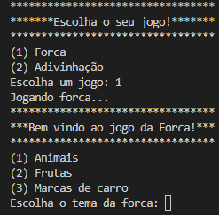
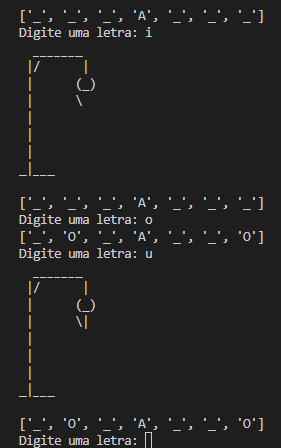
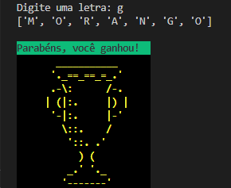
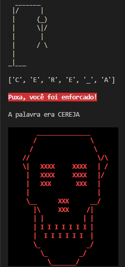

## Games Python 🎮

Desenvolvido durante o curso "**Python: avançando na linguagem**" da [Alura](https://www.alura.com.br/).

---

### Sobre o projeto

>O intuito do projeto é demonstrar de forma didática e divertida conceitos introdutórios da linguagem Python, por meio da implementação de "mini-games" como '<em>forca</em>' e '<em>adivinhe o número</em>'. Dentre os conceitos desenvolvidos estão:

- Refatoração
- Tipos de coleções
- List Comprehensions
- Abrir, ler e fechar um arquivo .txt
- Modulação de arquivos
- Convenção de nomenclatura snake_case
- Utilização de bibliotecas <b>built-in</b> como (***os***, ***glob*** e ***random***)

---

### Terminal

---

---

---

---

---

### Ferramentas utilizadas

  
  
  

